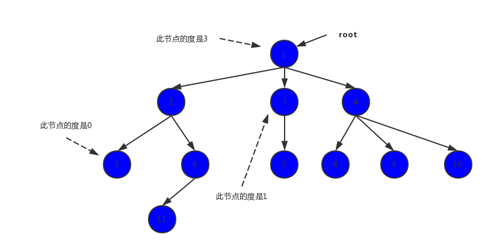

## 小笔记

### 学习Vue
-  [Vue node](learnVue/vue-node.md)

### 学习React
-  [React node](learnReact/learnReact.md)

### 其他方面
-  [解决git提交代码每次都需要输入密码问题](gitNotes/generateCertificate.md)
-  [npm 安装报错 error network 'proxy' config is set properly.](other/npm_error.md)
-  [npm notes](other/npm-notes.md)
-  [安装依赖 eslint](other/eslint_error.md)
-  [终端翻墙](other/terminals.md)

## 根据一名【合格】前端工程师的自检清单 每日一记

来自 [一名【合格】前端工程师的自检清单](https://mp.weixin.qq.com/s?__biz=MzAwNDcyNjI3OA==&mid=2650842922&idx=1&sn=9430980473c8b55de16f13ec47b6cba9&chksm=80d38c43b7a40555c2bc3ae5801d554145ec547a0a2cea34d4ecd60f11eed6f94c59a4a05d9f&scene=0&xtrack=1&key=f8a21a8df9909cbbceeacb33f9612d5cb45858249099c33a4ecfa99ad453c192c27a62acbd22a496f9949636e9778ff013d7e2555ad88e403a664bb3955a1584c157ee34db81e5d55b2c34de354551aa&ascene=1&uin=MjkwNDAwMTQzNw%3D%3D&devicetype=Windows+10&version=62060833&lang=zh_CN&pass_ticket=FzRfPh7EJrl07iw1IJdj%2BlRCbQd9zm6HJh8Nfwg4xmawW9Z27DcogAEmNcixiGwc##)

## 一、JavaScript基础

### 1.JavaScript基础 
* JavaScript规定了几种语言类型

<font color=#eea236>Boolean、Null、Undefined、Number、String、Object、Symbol (ES6 引入新的原始数据类型)</font>
```   
 原始/值数据类型：变量是存放在栈区的（栈区指内存里的栈内存）
		简单的数据段。按值访问，可以操作保存在变量中实际的值。（null、undefined特殊）
	* Boolean: 布尔
	* Null: 空值 空对象/对象不存在 
		表示尚未存在的对象，常用来表示函数企图返回一个不存在的对象。
	* Undefined: 缺失值
		所有已声明但是没有初始化的变量，默认值都为undefined。
		函数没有明确返回值的时候，会默认返回undefined。
		调用函数时应该提供的参数还没有提供，该参数就等于undefined
		对象没有赋值的属性，该属性的值就等于undefined
	* Number: 数字
	* String: 字符串
	* Symbol: Symbol值通过symbol函数生成,表示独一无二的值

引用/对象数据类型：值是同时保存在栈内存和堆内存中的对象
	有多个值构成的对象。引用类型的值是按引用访问的。JavaScript不允许直接访问内存中的位置，也就是说不能直接操作对象的内存空间,只能操作对象在栈内存中的引用地址。
	* Object: 对象类型 例如：Object 、Array 、Function 、Data等
``` 	
思考1:  [js 基本类型与引用类型的区别一](https://www.cnblogs.com/focusxxxxy/p/6390536.html)

以下总结摘自: [js 基本类型与引用类型的区别二](https://www.cnblogs.com/cxying93/p/6106469.html)   
``` 
总结区别

　　a 声明变量时不同的内存分配：　

　　1）原始值：存储在栈（stack）中的简单数据段，也就是说，它们的值直接存储在变量访问的位置。

　　　　这是因为这些原始类型占据的空间是固定的，所以可将他们存储在较小的内存区域 – 栈中。这样存储便于迅速查寻变量的值。

　　2）引用值：存储在堆（heap）中的对象，也就是说，存储在变量处的值是一个指针（point），指向存储对象的内存地址。

　　　  这是因为：引用值的大小会改变，所以不能把它放在栈中，否则会降低变量查寻的速度。相反，放在变量的栈空间中的值是该对象存储在堆中的地址。

　　　  地址的大小是固定的，所以把它存储在栈中对变量性能无任何负面影响。

　　b 不同的内存分配机制也带来了不同的访问机制
　　　
　　1）在javascript中是不允许直接访问保存在堆内存中的对象的，所以在访问一个对象时，
　　　　首先得到的是这个对象在堆内存中的地址，然后再按照这个地址去获得这个对象中的值，这就是传说中的按引用访问。
　　2）而原始类型的值则是可以直接访问到的。
　　
　　c 复制变量时的不同
　　
　　1）原始值：在将一个保存着原始值的变量复制给另一个变量时，会将原始值的副本赋值给新变量，此后这两个变量是完全独立的，他们只是拥有相同的value而已。
　　2）引用值：在将一个保存着对象内存地址的变量复制给另一个变量时，会把这个内存地址赋值给新变量，
　　　　也就是说这两个变量都指向了堆内存中的同一个对象，他们中任何一个作出的改变都会反映在另一个身上。
　　　　（这里要理解的一点就是，复制对象时并不会在堆内存中新生成一个一模一样的对象，只是多了一个保存指向这个对象指针的变量罢了）。多了一个指针
　
　　d 参数传递的不同（把实参复制给形参的过程）
　　
　　首先我们应该明确一点：ECMAScript中所有函数的参数都是按值来传递的。
　　但是为什么涉及到原始类型与引用类型的值时仍然有区别呢？还不就是因为内存分配时的差别。 　
　　1）原始值：只是把变量里的值传递给参数，之后参数和这个变量互不影响。
　　2）引用值：对象变量它里面的值是这个对象在堆内存中的内存地址，这一点你要时刻铭记在心！
　　　　因此它传递的值也就是这个内存地址，这也就是为什么函数内部对这个参数的修改会体现在外部的原因了，因为它们都指向同一个对象。

思考2: 如何判断数据类型？
``` 
[判断JS数据类型的四种方法](https://www.cnblogs.com/onepixel/p/5126046.html)

* JavaScript对象的底层数据结构是什么 
	
[从Chrome源码看JS Object的实现](https://zhuanlan.zhihu.com/p/26169639)

```  
Object:根父母
HeadObject:提供存储基本功能
JSReceiver:用于原型查找
JSObject: JS Object       FixedArray:实际存储数据的地方
``` 

* Symbol类型在实际开发中的应用、可手动实现一个简单的 Symbol
``` 
ES5 对象属性名都是字符串类型，容易造成属性名的冲突
ES6 引入 Symbol的原因就是为了保证每个属性的名字都是独一无二，从根本上防止属性名冲突

Symbol 值是通过Symbol函数生成。
所以对象的属性名有两种类型
1. 字符串
2. Symbol 类型

Symbol不能使用 new 命令，因为Symb是原始类型的值，不是对象。由于Symbol值不是对象，所以不能添加属性
Symbol 函数可以接受一个字符串作为参数

let s = Symbol("test")
Symbol 函数的参数值表示对当前Symbol值的描述，相同参数的Symbol函数的返回值是不相等 
```   

* JavaScript中的变量在内存中的具体存储形式

```  
具体存储形式  栈内存和堆内存
JavaScript中的变量分为基本类型和引用类型
基本类型是保存在栈内存中的简单数据段，值都是用固定的大小，保存在栈空间，按值访问
引用类型是保存在堆内存中的对象，值大小不固定，栈内存中存放的该对象的访问地址指向堆内存中的对象，JavaScript不允许直接访问堆内存的位置，所以操作对象时候，实际是操作对象的引用
所以当要访问堆内存中的引用数据类型时候，首先从栈中获取该对象的地址引用，然后再从堆内存中获取我们需要的数据
```  	
[JavaScript中的变量在内存中的具体存储形式](https://juejin.im/entry/5d233ce9f265da1b8608aadd)
```  
复制行为：
基本类型复制
let a = 20;
let b = a;
b = 30;
console.log(a); // 20

引用类型复制
let a = { x: 10, y: 20 }
let b = a;
b.x = 5;
console.log(a.x); // 5
```  	

* 基本类型对应的内置对象，以及他们之间的装箱拆箱操作
```
引用类型:
Object类型
Array类型
Date类型
RegExp
Function类型

基本包装类型(是基本类型也是引用类型，所以叫基本包装类型):
基本包装类型是ECMAScript为了便于操作基本类型值提供的三种特殊的引用类型:
Boolean
Number
String

每当读取一个基本类型的时候，后台就会创建一个对应的基本包装类型对象，从而让我们能够调用一些方法来操作这些数据。(隐式装箱)---《javascript高级程序设计》
（1）创建一个String类型的实例　　
（2）在实例上调用指定方法　　
（3）销毁这个实例

单体内置对象（Global、Math）

操作对象时，实际上是在操作对象的引用而不是实际的对象。

引用类型和基本包装类型的区别在于对象的生存期：
引用类型:使用new操作符创建的应用类型实例，在执行流离开当前作用域之前都一直保存在内存当中。
基本包装类型:自动创建的基本包装类型对象，只存在于一行代码执行的瞬间，然后立即被销毁。

装箱就是把基本类型转换为对应的内置对象，这里可分为隐式和显式装箱
拆箱就是与装箱相反，把对象转变为基本类型的值。
```
* null和 undefined的区别
```  
Null: 空值 空对象/对象不存在 
	表示尚未存在的对象，常用来表示函数企图返回一个不存在的对象。作为函数参数，表示该函数的参数不是对象
		
	作为对象原型链的终点

	Object.getPrototypeOf(Object.prototype)		
		
Undefined: 缺失值

	所有已声明但是没有初始化的变量，默认值都为undefined。

	let a

	函数没有明确返回值的时候，会默认返回undefined。

	var x = f();

	调用函数时应该提供的参数还没有提供，该参数就等于undefined

	function f(x){console.log(x)}

	对象没有赋值的属性，该属性的值就等于undefined

	var  o = new Object();
	o.p 

* 至少可以说出三种判断 JavaScript数据类型的方式，以及他们的优缺点，如何准确的判断数组类型

1.typeof
优点：使用简单，基本类型（除了null）都可以使用typeof来准确判断，引用类型返回都是object，所有对象的原型链最终都是指向Object,万物皆对象
缺点：有时候无法判断某个对象的具体类型 typeof null返回object 特殊值null被认为是一个空对象的引用

2.instanceof
优点：能检测出引用类型。就是利用原型链判断"父级"的原型对象是否在“实例”的原型链上，如果在则 true 否则 false 
缺点：只能判断两个对象间是否有实例关系，无法准确判断实例具体数据类型。另外只能判断对象类型，原始类型是不可以的。并且所有的对象类型 instance Object 都是true
		instance 不能跨 iframe
```  				
``` js				
	 var  arry = [1,2,3,4];    
	 var el = document.createElement('iframe');//在当前document中创建一个iframe
	 document.append(el);
	 arry instanceof window.Array // true
	 arry instanceof window.frames[0].Array // false
``` 
```  
因为iframe 有自己单独的window对象，Array只是window下的一个属性，window对象不相等那么引入也不一样
 
 3.constructor
 优点：性能快 基本能检测出所有类型（除了null 和 undefined：null 和 undefined是无效的对象 所以不会有constructor存在）
 缺点：constructor不能跨 iframe ，另外容易被修改。主要是自定义的对象可以通过prototype的属性重写，原有的constructor引用会丢失，constructor会默认为object
 
 4.toString
 优点：tostring 是object原型上的方法，该方法默认返回其调用者的具体类型。是toString运行this指向的对象类型返回的类型。能检测出所有类型
 缺点：IE6 undefined和null均为Object
```  

* 可能发生隐式类型转换的场景以及转换原则，应如何避免或巧妙应用

* 出现小数精度丢失的原因， JavaScript可以存储的最大数字、最大安全数字， JavaScript处理大数字的方法、避免精度丢失的方法


### 2.原型和原型链

* 理解原型设计模式以及 JavaScript中的原型规则

```  		
   原型设计模式：
		函数中不对属性进行定义，利用prototype（显式原型）去定义属性，这样可以让所有实例对象共享它包含的属性和方法
		(GOF将原型设计模式引用为通过克隆的方式，将现有的对象模板创建对象的模式)
		
		js原型规则
		1.所有的引用类型（数组对象函数）都拥有普通对象的特征，可以自由扩展属性
		2.所有构造函数都有prototype（显式原型），其实也是一个普通原型
		3.所有的引用类型都有_proto_(隐式原型)属性，属性值是一个普通原型
		4.引用类型的_proto_(隐式原型) === 其构造函数的prototype（显式原型） obj（实例）._proto_ === Object(构造函数).prototype（显式原型）=> 原型
		5.当试图获取一个对象的属性是，如果对象本身没有这个属性那么去其_proto_(隐式原型)寻找【Object(构造函数).prototype（显式原型）】
				
		原型链
		当尝试去获取对象f属性时，但是f中找不到该属性，我们就可以去f._proto_去寻找（也就是f的构造函数的prototype），如果f._proto_也没有就继续去f._proto_._proto_寻找（
		f的构造函数的prototype的构造函数的prototype）寻找，这样一层一层向上查找形成的链式结构就是为原型链   直到原型为null为止 （object的prototype 为null）
		
* instanceof的底层实现原理，手动实现一个 instanceof
		
   instanceof：A instance B  判断 A 是否是 B 的实例 检测是原型
	 查看对象B的prototype属性指向的对象原型是否在对象A的原型链上，如果在则 true 否则 false
	 就是利用原型链判断"父级"的原型对象prototype是否在“实例”的原型链上
```  		
		
``` js
//实现instanceof 
function instance_of(left,right){
	let _right = right.prototype;
	_left = left.__proto__;
	while(true){
		if(_left === null){
			return false
		}
		if(_left === _right){
			return true
			_left = left.__proto__
		}	
	}		
}
``` 
``` 
假设去判断类型
1.typeof ：判断基本类型 例如 Boolean、Null、Undefined、Number、String 其他的引用类型和null返回object
2.instanceof：arr instance Array

从 instanceof 能够判断出 [ ].__proto__  指向 Array.prototype，而 Array.prototype.__proto__ 又指向了Object.prototype，最终 Object.prototype.__proto__ 指向了null，标志着原型链的结束。
因此，[]、Array、Object 就在内部形成了一条原型链

instance只能判断两个对象是否是实例关系，并不能判断一个对象实例具体属于哪种类型
3.constructor： ''.constructor == String   new Number(1).constructor == Number
一个函数被定义的时候，会有一个原型的属性 prototype（js引擎添加），然后会在protype添加constructor属性，并让它指向函数的引用
当 let f = new F() 时，F()被当做是构造函数，f是F()构造函数的实例对象 F原型的constructor就会传递到f上，f.constructor==F
F利用原型对象的constructor引用了自身，当F做为构造函数创建实例对象时候，原型上的constructor就会传递到新创建的对象上，从原型链角度看
F构造函数就是新对象的类型，那么新对象则可以通过constructor去寻找数据类型
true.constructor == Boolen //true
注意:1.null和undefined是无效的对象，所以是不会有constructor存在，需要其他方式判断
2.函数的constructor是不稳定，主要是自定义的对象可以通过prototype的属性重写，原有的constructor引用会丢失，constructor会默认为object

4.toString：A.prototye.toString.call()

toString 是原型的方法，调用这个方法返回的是对象的[[class]](内部属性)，[[class]]值为一个类型字符串，可以用来判断值的类型 格式[object XX] 而XX就是该对象的类型
对于object对象可以直接调用，返回就是[object,object] 其他对象就需要用call/apply来调用 如果其他对象直接使用toString 返回都是内容的字符串
call 方法的第一个参数会被当作 this，所以 arr.toString() 与 Object.prototype.toString.call(arr) 并没有改变 this，而是改变了调用的函数。
如 A.prototype.toString.call(23)  返回就是 [object,number]

5.Array.isArray()  isArray()是ES5标准规定的判断数组类型的标准方法 
Array.isArray(object) 返回的是布尔值，如果object是数组返回true 否则为false
``` 
* 实现继承的几种方式以及他们的优缺点

``` 
1.原型链继承
核心：将父类实例作为子类原型
优点：
1.方法的复用 方法定义在父类的原型上，复用了父类构造函数的方法 父类新增原型方法/原型属性，子类都能访问得到
2.简单，易于实现
3.纯粹的继承关系，实例是子类的实例也是父类的实例
缺点：
1.创建子类实例时候是不能传参
2.子类实例共享了父类构造函数的引用属性
```
```js
function Animal(){
	this.name = "animal";
	this.colors = ["black","yellow"]
}
Animal.prototype = {
	sayName:function(){
		console.log(this.name)
	}
}

function Cat(){
	this.color = "white"
}
Cat.prototype = new Animal();
// 子对象的方法其实是定义再父类对象的实例上
Cat.prototype.sayColor = function(){
	console.log(this.color)
}

let cat1 = new Cat();
let cat2 = new Cat();
console.log(cat1);
cat1.colors.push("greg");
console.log(cat1);
console.log(cat2)
cat1.sayColor();
cat1.sayName();
```

		
2.构造函数继承
核心：将父类构造函数的内容复制给子类的构造函数。这是所有继承中唯一一个不涉及到prototype的继承
优点：
1.父类的引用属性不会被共享
2.子类构建实例时候可以向父类传参(与原型链继承完全相反)
缺点：
1.父类的方法不能复用，子类实例的方法每次都是单独创建
```
```js
```
	
3.组合继承
核心：原型链继承和构造函数继承的组合，兼具两者优点
优点：父类的方法可以被复用，父类的引用属性不会被共享，子类构建实例时候可以向父类传参
缺点：调用两次父类的构造函数，第一次给子类的原型添加父类的name，arr 属性，第二次又给子类的构造函数添加了父类的name，arr属性。从而覆盖子类原型中的同名参数，这种被覆盖的情况造成性能上的浪费
```js
```

4.寄生继承
核心：通过寄生的方式，去掉父类的实例属性
优点：
缺点：
```js
```
			
5.ES6 class
核心：
优点：
缺点：
		
``` 
```js
```
		
		

* 至少说出一种开源项目(如 Node)中应用原型继承的案例

* 可以描述 new 一个对象的详细过程，手动实现一个 new操作符

``` 
1. 创建一个新的对象，同时继承对象类的原型，Person.prototype
2. 执行对象类的构造方法，同时该实例的属性和方法都会被this 引用，也就是this指向新构造的实例
3. 如果该构造函数return 一个新的对象，那么这个对象就会取代整个new出来的结果，如果构造函数没有return对象，那么就会返回1所创建的对象，隐式返回this
（一般情况下，构造函数是不会返回一个新的对象，如果用户想要覆盖这个对象，可以选择返回一个普通的对象来覆盖）


Object.create() 会使用指定的原型对象及其属性去创建一个新的对象
Object.create(proto,[propertiesObject])
proto
一个对象，应该是新创建的对象的原型。
propertiesObject
可选。该参数对象是一组属性与值，该对象的属性名称将是新创建的对象的属性名称，值是属性描述符（这些属性描述符的结构与Object.defineProperties()的第二个参数一样）。
注意：该参数对象不能是 undefined，另外只有该对象中自身拥有的可枚举的属性才有效，也就是说该对象的原型链上属性是无效的。
call
call()方法在使用一个指定的this值或若干个指定的参数值的前段提调用某个函数或方法，
作用：
1：就是借用另外一个对象的方法，而不需要拷贝
2：将伪数组变为真数组 伪数组就是一个包含length属性的json对象 他不是一个真数组，其实都是在模拟一个集合（描述集合数据）
apply
apply()方法用于解决一个对象如何调用不属于它的方法
只有一个区别，就是call()方法接受的是若干个参数的列表，而apply()方法接受的是一个包含多个参数的数组。
call和apply好处:方便我们解耦，对象不需要和方法有任何的耦合性，能使我们写出更好的面相对象程序。

foo.call(this, arg1,arg2,arg3) == foo.apply(this, arguments) == this.foo(arg1, arg2, arg3)
``` 

``` js		
		function newfunction(Obj,...args){
			var obj = Object.create(Obj.prototype);
			let result = Obj.apply(obj,args);
			return typeof obj === "object"? result : obj
		}
		
``` 

* 理解 es6 class构造以及继承的底层实现原理

``` 		
class 相当于构造函数再封装了一层
``` 		


### 3.作用域和闭包

* 理解词法作用域和动态作用域

* 理解 JavaScript的作用域和作用域链

* 理解 JavaScript的执行上下文栈，可以应用堆栈信息快速定位问题

* this的原理以及几种不同使用场景的取值

* 闭包的实现原理和作用，可以列举几个开发中闭包的实际应用

* 理解堆栈溢出和内存泄漏的原理，如何防止

* 如何处理循环的异步操作

* 理解模块化解决的实际问题，可列举几个模块化方案并理解其中原理

### 4.执行机制

* 为何 try里面放 return， finally还会执行，理解其内部机制

* JavaScript如何实现异步编程，可以详细描述 EventLoop机制

* 宏任务和微任务分别有哪些

* 可以快速分析一个复杂的异步嵌套逻辑，并掌握分析方法

* 使用 Promise 实现串行

* Node与浏览器 EventLoop的差异

* 如何在保证页面运行流畅的情况下处理海量数据

### 5.语法和API

* 理解 ECMAScript和 JavaScript的关系

* 熟练运用 es5、 es6提供的语法规范

* 熟练掌握 JavaScript提供的全局对象（例如 Date、 Math）、全局函数（例如 decodeURI、 isNaN）、全局属性（例如 Infinity、 undefined）

* 熟练应用 map、 reduce、 filter 等高阶函数解决问题

* setInterval需要注意的点，使用 settimeout实现 setInterval

* JavaScript提供的正则表达式 API、可以使用正则表达式（邮箱校验、 URL解析、去重等）解决常见问题

* JavaScript异常处理的方式，统一的异常处理方案


## 二、HTML和CSS

### 1.HTML

* 从规范的角度理解 HTML，从分类和语义的角度使用标签

* 常用页面标签的默认样式、自带属性、不同浏览器的差异、处理浏览器兼容问题的方式

* 元信息类标签( head、 title、 meta)的使用目的和配置方法

* HTML5离线缓存原理

``` 	
HTML5 离线缓存原理是通过创建manifest 文件（缓存清单文件.appcache文件）的缓存机制（不是存储技术），通过这个文件上的清单解析离线存储资源
这些资源就会像cookie一样被存储下来。当网络处于离线状态时候，浏览器就会通过被离线存储的数据进行页面展示

优点：1.离线浏览
	 2.减少服务器负载 浏览器只从服务器下载更新过的或者更改过的资源
	 3.速度 对已缓存的资源加载的更快
						 
与传统浏览器缓存的区别
1.离线缓存可以是对整个应用，浏览器缓存则是单个文件
2.离线缓存可以离线访问依然能打开页面，浏览器缓存不可以
3.离线缓存能通知浏览器更新资源
``` 		
		
* 可以使用 CanvasAPI、 SVG等绘制高性能的动画

### 2.CSS

* CSS盒模型，在不同浏览器的差异

``` 	
不管是IE盒子模型还是W3C盒子标准模型 都是包含 content padding border mragin
不同的是
IE  怪异盒子模型   content 宽度 = content内容的宽度 + padding + border
W3C 标准盒模型 content 宽度 = content内容的宽度 
所以计算盒子占据的位置
IE盒子模型解释占据的位置 = content + margin
W3C 盒子模型解释占据的位置 = content + padding + border + margin

为了避免不同浏览器产生效果不一样，通常我们统一会使用W3C标准盒子模型来 在网页的顶部加上doctype声明
<!doctype html public "-//w3c//dtd xhtml 1.0 transitional//en" "http://www.w3.org/tr/xhtml1/dtd/xhtml1-transitional.dtd">

box-sizing:"border-box"
类似于IE怪异盒子模型 假设某个div 中的 css 设置这个属性后，设置的宽度就会包含padding 和 border
有时候我们设置了宽度，但是通过添加了padding 和border 时候，这个div所占据的真正宽度就会相应的变化，
这时候我们通过设置box-sizing 那么这个真实的宽度则不会变化，会通过自动调整content的宽度，来保证真实宽度不会变化
``` 
* CSS所有选择器及其优先级、使用场景，哪些可以继承，如何运用 at 规则

``` 
CSS 三个特性 继承，优先级和层叠
继承：子类元素继承父类的样式
优先级：是指不同类别样式的权重比较
层叠：是说当数量相同是，通过层叠（后者覆盖前者）的样式

css 选择器
1.类选择器 （class="name"）
2.id选择器	（id="name"）
3.标签选择器（body li）
4.全局选择器 (*)
5.组合选择器（.head .head_log 空格隔开）
6.后代选择器（.nav ul li 父集到子孙集）
7.群组选择器（div,li,span{color:yellow}）
8.继承选择器（div p{}）
9.伪类选择器（ a 元素伪类 4个不同的状态 link visited active hover）
10.字符串匹配的属性选择符(^ $ *三种，分别对应开始、结尾、包含)
11.子选择器 (如：div>p ,带大于号>)
12.CSS 相邻兄弟选择器 (如：h1+p,带加号+)

优先级
当两个规则都作用到同一个元素上时候，如果定义的属性有冲突，那么用谁的值 css有一套优先级的定义

1.不同级别的
!import> style 行内样式 > id选择器 > class选择器 > 标签选择器 > 全局选择器 > 浏览器自定义或继承

2.同级别的
后写的会覆盖先写的样式
多个级别的组合 　四个级别分别为：行内选择符、ID选择符、类别选择符、元素选择符。

简洁，高效的css 
1. 不要在id选择器前使用标签
2. 不要在类选择器前使用标签
3. 少用层级关系
4. 使用类选择器代替层级关系（解析顺序是从右往左的解析的）

css 选择器解析顺序：从右到左（从右往左进行解析还是会比从左往右解析要少很多次的匹配
从右往左进行匹配的时候，匹配的全部是DOM元素的父节点，而从左往右进行匹配的时候时候，
匹配的全部是DOM元素的子节点，这样就避免了HTML与CSS没有下载完需要进行等待的情形）
 

继承（Inherited）
[继承](https://www.jianshu.com/p/cd89de075079)
CSS继承：继承就是子标签继承了上级标签的CSS样式的属性
不可继承的：display、margin、border、padding、background、height、min-height、max-height、width、min-width、max-width、overflow、position、left、right、top、bottom、z-index、float、clear、table-layout、vertical-align、page-break-after、page-bread-before 和 unicode-bidi。
所有元素可继承：visibility 和 cursor。
内联元素可继承：letter-spacing、word-spacing、white-space、line-height、color、font、font-family、font-size、font-style、font-variant、font-weight、text-decoration、text-transform、direction。
注意：<a>标签有自己的颜色和样式，不会继承自父元素
终端块状元素可继承：text-indent 和 text-align。
列表元素可继承：list-style、list-style-type、list-style-position、list-style-image。
表格元素可继承：border-collapse

优先级的算法：
每个规则对应一个初始"四位数"：0、0、0、0
若是 行内选择符，则加 1、0、0、0
若是 ID选择符，则加 0、1、0、0
若是 类选择符/属性选择符/伪类选择符，则分别加 0、0、1、0
若是 元素选择符/伪元素选择符，则分别加 0、0、0、1
CSS是定义权重规则 标签的权重为1，class的权重为10，id的权重为100 行内1000

@规则（at-rule）是一条语句 为css 提供了执行或如何执行的指令
@规则 分为常规规则和嵌套规则
常规规则
@[关键词](规则)
例如 
@charset 'utf-8'  定义字符集 
@important 'custom.css'  导入其他css样式文件
@namespace url(http://XXXX) 应用在XML(XHTML)特别有用，这样XHTML元素就可以作为选择器在css 中使用

嵌套规则 是嵌套语句的子集,不仅可以作为样式表里的一个语句，也可以用在条件规则组里：
@[KEYWORD] {
	/* 嵌套语句 */
}
@media, 如果满足媒介查询的条件则条件规则组里的规则生效。
@media all and (min-width: 1280px) {
	/* 宽度大于1280 */ 
}

@page, 描述打印文档时布局的变化.
@page :first {
	margin: 1in;
}

@font-face, 描述将下载的外部的字体 自定义字体。 
@font-face {
	font-family: 'MyWebFont';
	src:  url('myfont.woff2') format('woff2'),
				url('myfont.woff') format('woff');
}

@keyframes, 描述 CSS 动画的中间步骤 . 
@keyframes fadeIn {
	0% {
		opacity: 0;
	}
	100% {
		opacity: 1;
	}
}

@supports, 如果满足给定条件则条件规则组里的规则生效。 
/* 检查是否支持CSS声明 */ 
@supports (display: flex) {
	.module { display: flex; }
}

@document, 如果文档样式表满足给定条件则条件规则组里的规则生效。 (推延至 CSS Level 4 规范)
[@document](https://developer.mozilla.org/zh-CN/docs/Web/CSS/@document)
url(), 匹配整个URL
url-prefix(), 匹配文档的URL是否以参数指定的值开头
domain(), 匹配文档的域名是否为参数中指定的域名或者为它的子域名
regexp(), 匹配文档的URL是否和参数中指定的正则表达式匹配.该表达式必须匹配整个URL.
@document url("https://www.example.com/") {
	h1 {
		color: green;
	}
}
``` 

* CSS伪类和伪元素有哪些，它们的区别和实际应用
	:before
	

* HTML文档流的排版规则， CSS几种定位的规则、定位参照物、对文档流的影响，如何选择最好的定位方式，雪碧图实现原理

* 水平垂直居中的方案、可以实现 6种以上并对比它们的优缺点

[居中](https://github.com/Crystal-LDJ/frontEndNotes/blob/master/selfChecking/css)
``` 
<div class="parent">
	<div class=children""></div>
</div>

1. 绝对定位 + margin: auto
优点：兼容性好 Support IE8+，支持百分比宽高
缺点：必须声明高度，不适用Windows Phone

.parent{
	position:relative
}
.children{
	position:absolute;
	width: 200px;
	height: 200px;
	top:0;
	right:0;
	bottom:0;
	left:0;
	margin:auto
}

2. 绝对定位 + 负边距margin  根据已知 children div 的长宽
优点：容性好 Support All Browser
缺点：定宽高且不支持百分比

.parent{
	position:relative
}
.children{
	position:absolute;
	width:200px;
	height:200px;
	top:50%;
	left:50%;
	margin-top:-100px;
	margin-left:-100px;
}

3. 绝对定位 + transform
优点：简洁，不定宽高
缺点：浏览器兼容性（适合移动端）可能与其他transform属性冲突

.parent{
	position:relative
}
.children{
	position:absolute;
	top:50%;
	left:50%;
	transform: translate(-50%,-50%)
}

4. flex 布局
优点：只需要设置父元素就可以了 实现不定宽高水平垂直居中
缺点：相容性不好
.parent{
	dispaly:flex;
	align-items:center; /* 子元素垂直居中 */
	justify-content: center;/* 子元素水平居中 */
}
.children{
	
}

5. table-cell 
优点：相容性高

.parent{
	dispaly:table-cell;
	text-align:center;
	vertical-align:middle;
}
.children{
	display:inline-block
}
``` 
* BFC实现原理，可以解决的问题，如何创建 BFC7.可使用 CSS函数复用代码，实现特殊效果
``` 
BFC(Block formatting context):块级格式化上下文
``` 
* PostCSS、 Sass、 Less的异同，以及使用配置，至少掌握一种

* CSS模块化方案、如何配置按需加载、如何防止 CSS阻塞渲染

* 熟练使用 CSS实现常见动画，如渐变、移动、旋转、缩放等等

* CSS浏览器兼容性写法，了解不同 API在不同浏览器下的兼容性情况

* 掌握一套完整的响应式布局方案

### 3.手写

* 手写图片瀑布流效果

* 使用 CSS绘制几何图形（圆形、三角形、扇形、菱形等）

* 使用纯 CSS实现曲线运动（贝塞尔曲线）

* 实现常用布局（三栏、圣杯、双飞翼、吸顶），可是说出多种方式并理解其优缺点

## 三、计算机基础

### 1.编译原理

* 理解代码到底是什么，计算机如何将代码转换为可以运行的目标程序

``` 
在通信和信息处理中，代码（code）是指一套转换信息的规则系统，例如将一个字母、单词、声音、图像或手势转换为另一种形式或表达，有时还会缩短或加密以便通过某种信道或存储媒体通信。
``` 	
	
* 正则表达式的匹配原理和性能优化

* 如何将 JavaScript代码解析成抽象语法树( AST)

* base64的编码原理
```
具体转换步骤:
	第一步，将待转换的字符串每三个字节分为一组，每个字节占8bit，那么共有24个二进制位。(6和8的最小公倍数为24，三个字节正好24个二进制位，每6个bit位一组，恰好能够分为4组)
	第二步，将上面的24个二进制位每6个一组，共分为4组。
	第三步，在每组前面添加两个0，每组由6个变为8个二进制位，总共32个二进制位，即四个字节。
	第四步，根据Base64编码对照表获得对应的值。
```
-  [一篇文章彻底弄懂Base64编码原理](https://blog.csdn.net/wo541075754/article/details/81734770)


* 几种进制的相互转换计算方法，在 JavaScript中如何表示和转换

### 2.网络协议

* 理解什么是协议，了解 TCP/IP网络协议族的构成，每层协议在应用程序中发挥的作用

* 三次握手和四次挥手详细原理，为什么要使用这种机制

* 有哪些协议是可靠， TCP有哪些手段保证可靠交付

* DNS的作用、 DNS解析的详细过程， DNS优化原理

* CDN的作用和原理

* HTTP请求报文和响应报文的具体组成，能理解常见请求头的含义，有几种请求方式，区别是什么

* HTTP所有状态码的具体含义，看到异常状态码能快速定位问题

* HTTP1.1、 HTTP2.0带来的改变

* HTTPS的加密原理，如何开启 HTTPS，如何劫持 HTTPS请求

* 理解 WebSocket协议的底层原理、与 HTTP的区别

### 3.设计模式

* 熟练使用前端常用的设计模式编写代码，如单例模式、装饰器模式、代理模式等

* 发布订阅模式和观察者模式的异同以及实际应用

* 可以说出几种设计模式在开发中的实际应用，理解框架源码中对设计模式的应用


## 四、数据结构和算法

### 1.JavaScript编码能力

* 多种方式实现数组去重、扁平化、对比优缺点
``` 		  
ES6方式
1. 去除简单类型 
Set 类似于数组，但是成员的值都是唯一的，没有重复值
Set 方法 Set本身是一个构造函数，用来生成Set数据结构。
Array.from:允许JavaScript集合如（如数组，类数组对象或者字符串，map，set等可迭代对象）上进行有用的转换

... 扩展运算符内部使用 for...of 循环
``` 			
``` js
let data = [1,2,3,1,2,3]
function unique(array){
	return Array.from(new Set(array))
}
console.log(unique(data))


let data = [1,2,3,1,2,3]
function unique(array){
	return [...new Set(arr)]
}
```
``` 
2. 去除引用类型 reduce 方法
``` 
``` js		
arr.reduce(callback,[initialValue])
callback <!-- 包含四个参数-->
previousValue<!-- 上一次调用回调返回的值，或者是提供初始值（initialValue -->
currentValue <!-- 数组中当前被处理的元素-->
index <!-- 当前元素在数组中的索引-->
array <!-- 调用reduce的数组-->

let array = [{
	"name":"A",
	"age":12
},{
	"name":"A",
	"age":12
},{
	"name":"B",
	"age":14
}]

var hash = {};
	
array = array.reduce(function(itemPre,current){
	hash[current.name]?'':hash[current.name] = true && itemPre.push(current)
	return itemPre
},[])
	
console.log(array)		
```
``` 
扁平化
``` 	
	


* 多种方式实现深拷贝、对比优缺点
``` 
浅克隆：对象只会被克隆最外部的一层，至于更深层的对象，依然是通过引用指向一块堆内存.所以如果浅克隆对象，一个更改另外一个同样也被更改，因为两个指向的是同一个地址
``` 
``` js		
function shallowClone(oldObject){
	let newObject = {};
	for(let i in oldObject){
		newObject[i]=oldObject[i]
	}
	return newObject	
}
```
``` 
Object.assign()：可以吧任意多个的原对象自身的可枚举属性拷贝到目标对象，然后返回目标对象，但是进行的是浅拷贝，拷贝的是对象的属性的引用，而不是对象本身，
但是呢如果object只有一层的时候是深拷贝
Object.assign方法的第一个参数是目标对象，后面的参数都是源对象。Object.assign(target, source1, source2);
如果目标对象与源对象有同名属性，或多个源对象有同名属性，则后面的属性会覆盖前面的属性。
```
``` 
深克隆：创建一个全新的对象，将原对象数据复制过去但是呢两者之间没有任何关系
```
``` js		
function deepClone(oldObject){
	if( typeof oldObject !="Object"){
		return oldObject
	}
	let newObject = {};
	for(let i in oldObject){
		newObject[i]=deepClone(oldObject[i])
	}
	return newObject	
}
```

* 手写函数柯里化工具函数、并理解其应用场景和优势


* 手写防抖和节流工具函数、并理解其内部原理和应用场景

``` 
防抖 debounce：在事件被触发n秒后再执行回调，如果在这n秒内又被触发，则重新计时
```
``` js
<!-- fn :要防抖的函数 delay: 延时时间 -->
function denounce(fn,delay){
	var timer = null
	return function(){
		//清除上一次的定时器
		clearTimeout(timer);
		//重新设定一个新的延时器
		timer = setTimeout(()=>{
				fn.call(this);
		},delay)
	}
}
``` 	
``` 
节流throttle：规定在的单位时间内，只能触发一次函数。如果这个单位时间内触发多次函数，只有一次生效
场景：
DOM 元素拖拽功能实现
设计游戏的keydown事件（单位时间只能发射一颗子弹）
canvas 模拟画板功能
搜索 keyup
scroll 监听滚动事件
``` 
``` js
<!-- fn :要节流的函数 delay: 延时时间 -->
function throttle(fn,delay){
	//设置当前时间
	var lastTime = 0;
	return function(){
		var nowTime = new Date().getTime();
		//当前时间与上一次时间执行的时间差 大于 指定间隔时间才可以触发这个函数
		if(nowTime-lastTime>delay){
			//绑定this 指向
			fn.call(this);
			//同步时间
			lastTime = nowTime
		}
	}
}
``` 

* 实现一个 sleep函数

### 2.手动实现前端轮子


* 手动实现 call、apply、bind


* 手动实现符合 Promise/A+规范的 Promise、手动实现 asyncawait


* 手写一个 EventEmitter实现事件发布、订阅


* 可以说出两种实现双向绑定的方案、可以手动实现


* 手写 JSON.stringify、 JSON.parse


* 手写一个模版引擎，并能解释其中原理


* 手写 懒加载、 下拉刷新、 上拉加载、 预加载等效果

### 3.数据结构

* 理解常见数据结构的特点，以及他们在不同场景下使用的优缺点

```     
数据结构:

栈：
	栈是一种特殊的线性表，仅仅能够在栈顶操作，先进后出，后进先出(LIFO)

队列：
	栈是一种特殊的线性表，与栈相反遵循先进先出原则的一组有序的项

链表：
	链表是物理存储单元上非连续的，非顺序的存储结构，由一系列节点组成
	节点：包括两部分一部分是存储数据元素的数据域，另外一部分是存储指向下一个节点的指针域
	首尾节点：链表的第一个节点是首节点，最后一个节点是尾节点
	
	有头链表和无头链表
	无头链表：第一个节点既有数据域，又有指针域，第一个节点即是首节点又是头节点
	有头链表：第一个节点只有指针域，没有数据域
				
树：
	树是一种非线性的数据结构，由n(n>=0)个节点组成的集合
	if n=0,是一棵空树
	if n>0, 树有一个特殊的节点，这个节点没有父节点，称为根节点(root) 
	除根节点之外的其余数据元素被分为 m(m>=0) 个互不相交的集合 T1，T2，....Tm-1，其中每一个集合Ti(1<=i<=m) 本身也是一棵树，被称作为原树的子树
	
	节点：包含数据项，和指向其他节点的指针
	节点的度：节点所拥有的子树的数量
```

``` 

叶节点：度为0的节点被称为叶节点
分支节点：除去叶节点的节点就是分支节点
子女节点：若节点x有子树，则这子树的根节点就是节点x的子女节点
父节点：若节点x有子树，则这x为子女节点的父节点
兄弟节点：同一个父节点的子女节点互相称为兄弟
祖先节点：从根节点到该节点所见过分支上的所有节点
子女节点：某一个节点的子女，以及这些子女的子女都是该节点的子孙节点
节点所在层次：根节点在第一层，它的子女 在第二层
树的深度：树中距离根节点最远的节点所处的层次就是树的深度
树的高度：叶节点的高度为1，非叶节点的高度就是他的子女节点高度的最大值加1，高度与深度数值相等，但计算方式不一样
树的度：树中节点的度的最大值
有序树：树中节点的各棵字树T1，T2...是有持续的，T1是第一棵子树，T2是第2棵子树
无序树：树中节点的各棵子树之间的次序不重要，可以互相交换位置
森林：森林是m(m>0)棵树的集合（森林的树增加根节点可以变成一棵树，同样删除根节点就变成了森林）

二叉树：二叉树是树的一种特殊情况，每个节点最多有两个子女，分别称为该节点的左节点和右节点。
			 在二叉树中，不存在度大于2的节点。二叉树的子树有左右之分，次序不能颠倒。
 性质：

特殊二叉树：
满二叉树：深度为k的满二叉树，是有个节点的二叉树，每一层都达到了可以容纳的最大数量的节点

完全二叉树：深度为k的完全二叉树，从第一层到第 都是满的，第k层，
	
堆：
用数组实现的二叉树，所以没有父指针或者子指针。堆根据 “堆属性” 来排序，“堆属性”决定了树中节点的位置。堆是最高效的一种数据结构

图：
图是顶点集合（vertex）和顶点间的关系（edge）组成的一种数据结构：Graph=（V，E）

有向图：顶点对<x,y>是有序的，<x,y>是从顶点x到顶点y的一条有向边，顶点x是顶点，顶点y是终点，<x,y>与<y,x>是两条不同的边。
无向图：顶点对(x,y)是无序的，(x,y)和(x,y)是同一条边。
完全图：一个无向图有n个顶点，有n(n-1)/2条边，那么它就是无向完全图，一个有向图中，有n个顶点，有n(n-1)条边，则是有向完全图。

权：边具有与之相关的数值，可以表示从一个顶点到另一个顶点的距离，耗费的时间，这个数值称为权重

邻接顶点：在无向图中，一条边是(u,v),那么u和v互为邻接顶点，在有向图，是一条边，那么顶点u邻接到顶点v，顶点v邻接自顶点u


度： 与顶点v关联的边数称为度。在有向图中，以v为终点的有向边的数量是v的入度，以v为始点有向边的数量为出度，v的度是入度和出度之和
路径： 从顶点vi 出发，沿着一些边经过vp1, vp2 ,..., vpm 到达vj，则称（vi， vp1, vp2 ,..., vpm， vj）是从顶点vi到vj的一条路径。


集合：

BitMap(位图)：
	 
用一个bit位来标记某个元素所对应的Value，而key即是该元素
基于位(Bit)做映射，能够用很少的内存存储数据，和数组不一样的是它只能存储表示某个数是否存在，可用于大数据去重，大数据排序，两个集合取交集
BitMap 在处理大数据时候有优势，要求数据集紧凑，最大的值决定了BitMap要用多少内存
      
``` 
* 理解 数组、 字符串的存储原理，并熟练应用他们解决问题


* 理解 二叉树、 栈、 队列、 哈希表的基本结构和特点，并可以应用它解决问题


* 了解 图、 堆的基本结构和使用场景

### 4.算法

* 可计算一个算法的时间复杂度和空间复杂度，可估计业务逻辑代码的耗时和内存消耗


* 至少理解五种排序算法的实现原理、应用场景、优缺点，可快速说出时间、空间复杂度


* 了解递归和循环的优缺点、应用场景、并可在开发中熟练应用


* 可应用 回溯算法、 贪心算法、 分治算法、 动态规划等解决复杂问题


* 前端处理海量数据的算法方案


## 五、运行环境

### 1.浏览器API

* 浏览器提供的符合 W3C标准的 DOM操作 API、浏览器差异、兼容性


* 浏览器提供的浏览器对象模型 ( BOM)提供的所有全局 API、浏览器差异、兼容性


* 大量 DOM操作、海量数据的性能优化(合并操作、 Diff、 requestAnimationFrame等)


* 浏览器海量数据存储、操作性能优化


* DOM事件流的具体实现机制、不同浏览器的差异、事件代理


* 前端发起网络请求的几种方式及其底层实现、可以手写原生 ajax、 fetch、可以熟练使用第三方库


* 浏览器的同源策略，如何避免同源策略，几种方式的异同点以及如何选型


* 浏览器提供的几种存储机制、优缺点、开发中正确的选择


* 浏览器跨标签通信


### 2.浏览器原理

* 各浏览器使用的 JavaScript引擎以及它们的异同点、如何在代码中进行区分


* 请求数据到请求结束与服务器进行了几次交互


* 可详细描述浏览器从输入 URL到页面展现的详细过程


* 浏览器解析 HTML代码的原理，以及构建 DOM树的流程


* 浏览器如何解析 CSS规则，并将其应用到 DOM树上


* 浏览器如何将解析好的带有样式的 DOM树进行绘制


* 浏览器的运行机制，如何配置资源异步同步加载


* 浏览器回流与重绘的底层原理，引发原因，如何有效避免


* 浏览器的垃圾回收机制，如何避免内存泄漏


* 浏览器采用的缓存方案，如何选择和控制合适的缓存方案


### 3.Node

* 理解 Node在应用程序中的作用，可以使用 Node搭建前端运行环境、使用 Node操作文件、操作数据库等等


* 掌握一种 Node开发框架，如 Express， Express和 Koa的区别


* 熟练使用 Node提供的 API如 Path、 Http、 ChildProcess等并理解其实现原理


* Node的底层运行原理、和浏览器的异同


* Node事件驱动、非阻塞机制的实现原理


##  六、框架和类库

### 1.TypeScript

* 理解 泛型、 接口等面向对象的相关概念， TypeScript对面向对象理念的实现


* 理解使用 TypeScript的好处，掌握 TypeScript基础语法


* TypeScript的规则检测原理


* 可以在 React、 Vue等框架中使用 TypeScript进行开发

### 2.React

* React和 vue选型和优缺点、核心架构的区别


* React中 setState的执行机制，如何有效的管理状态


* React的事件底层实现机制


* React的虚拟 DOM和 Diff算法的内部实现


* React的 Fiber工作原理，解决了什么问题


* ReactRouter和 VueRouter的底层实现原理、动态加载实现原理


* 可熟练应用 ReactAPI、生命周期等，可应用 HOC、 render props、 Hooks等高阶用法解决问题


* 基于 React的特性和原理，可以手动实现一个简单的 React

### 3.Vue

* 熟练使用 Vue的 API、生命周期、钩子函数


* MVVM框架设计理念


* Vue双向绑定实现原理、 Diff算法的内部实现


* Vue的事件机制


* 从 template转换成真实 DOM的实现机制

### 4.多端开发

* 单页面应用（ SPA）的原理和优缺点，掌握一种快速开发 SPA的方案


* 理解 Viewport、 em、 rem的原理和用法，分辨率、 px、 ppi、 dpi、 dp的区别和实际应用


* 移动端页面适配解决方案、不同机型适配方案


* 掌握一种 JavaScript移动客户端开发技术，如 ReactNative：可以搭建 ReactNative开发环境，熟练进行开发，可理解 ReactNative的运作原理，不同端适配


* 掌握一种 JavaScript PC客户端开发技术，如 Electron：可搭建 Electron开发环境，熟练进行开发，可理解 Electron的运作原理


* 掌握一种小程序开发框架或原生小程序开发


* 理解多端框架的内部实现原理，至少了解一个多端框架的使用

### 5.数据流管理

* 掌握 React和 Vue传统的跨组件通信方案，对比采用数据流管理框架的异同


* 熟练使用 Redux管理数据流，并理解其实现原理，中间件实现原理


* 熟练使用 Mobx管理数据流，并理解其实现原理，相比 Redux有什么优势


* 熟练使用 Vuex管理数据流，并理解其实现原理


* 以上数据流方案的异同和优缺点，不情况下的技术选型

### 6.实用库

* 至少掌握一种 UI组件框架，如 antd design，理解其设计理念、底层实现


* 掌握一种图表绘制框架，如 Echart，理解其设计理念、底层实现，可以自己实现图表
    
  Echart 设计理念
    
    
    
* 掌握一种 GIS开发框架，如百度地图 API


* 掌握一种可视化开发框架，如 Three.js、 D3


* 工具函数库，如 lodash、 underscore、 moment等，理解使用的工具类或工具函数的具体实现原理


## 七、前端工程

### 1.项目构建

* 理解 npm、 yarn依赖包管理的原理，两者的区别

* 可以使用 npm运行自定义脚本

* 理解 Babel、 ESLint、 webpack等工具在项目中承担的作用

* ESLint规则检测原理，常用的 ESLint配置

* Babel的核心原理，可以自己编写一个 Babel插件

* 可以配置一种前端代码兼容方案，如 Polyfill

*  Webpack的编译原理、构建流程、热更新原理， chunk、 bundle和 module的区别和应用

* 可熟练配置已有的 loaders和 plugins解决问题，可以自己编写 loaders和 plugins

### 2.nginx

* 正向代理与反向代理的特点和实例

```   
正向代理特点：客户端非常明确要访问的服务器地址。正向代理模式屏蔽或者隐藏了真是客户端信息

用途：

1.访问原来无法访问的资源，如Google

2.可以做缓存，加速访问资源

3.对客户端访问授权，上网进行认证

4.代理可以记录用户访问记录（上网行为管理），对外隐藏用户信息

反向代理对外是透明的，访问者并不知道直接访问的一个代理。所以客户端不需要任何配置就可以访问

用途：

保证内网的安全，通常将反向代理作为公网访问地址，Web服务器是内网

负载均衡，通过反向代理服务器来优化网站的负载
```     

* 可手动搭建一个简单的 nginx服务器、

* 熟练应用常用的 nginx内置变量，掌握常用的匹配规则写法

* 可以用 nginx实现请求过滤、配置 gzip、负载均衡等，并能解释其内部原理

### 3.开发提速

* 熟练掌握一种接口管理、接口 mock工具的使用，如 yapi

* 掌握一种高效的日志埋点方案，可快速使用日志查询工具定位线上问题

* 理解 TDD与 BDD模式，至少会使用一种前端单元测试框架

### 4.版本控制

* 理解 Git的核心原理、工作流程、和 SVN的区别

``` 
Git的核心原理

(本地)
1.工作区：当前进行工作区域，是文件系统的概念	 工作目录就是执行git init的地方
2.暂存区：记录下次要提交将要保存到版本库中的文件  在.git 目录下
3.版本库：记录工程某次提交的完整状态和内容，意味着该数据永远不会丢失 在.git 目录下

所有文件只处于其中一个状态（本地）
已修改 (modified)： 表示已修改但是没有保存到数据库，处于本地的工作区
已暂存(staged)： 表示对已修改的文件的当前版本做标识，让它包含在下一次提交的快照中 ，处于暂存区
已提交(committed)： 表示完成修改并保存到本地数据库中，处于已提交域

处理结束再将本地仓库的最新状态文件快照 推送到远程仓库	(中心服务器)


Git的工作流程

1.在本地工作区/工作目录中修改文件，文件modified
2.暂存文件，add 把文件快照放入暂存区域，处于等待状态
3.commit并push 找到暂存区域文件，并将快照永久性的存储到Git远程仓库

Git和 SVN的区别

1.非集中式存储

传统的SVN(集中式版本控制)要依赖特定的服务器实现版本管理功能，SVN必须联网才能正常工作。如果宕机一段时间 服务器崩溃情况 在这期间开发很难正在工作的版本上合作或者保存某一个版本的改变，或者中央数据库的磁盘出现问题但是没有备份导致丢失文件。解决方案把所有人的本地代码合并得到完整的版本但是将会会丢失历史版本/日志。


Git (分布式版本控制) 不依赖特定的服务器完成功能 客户端不仅仅是检查文件的最新快照[完全镜像的存储库也就是本地有仓库]所以如果出现一样的情况，任何一个客户端仓库都可以备份到服务器来恢复数据。所以每一个clone是所有数据的完整备份 除了没有push的代码。另外Git 是支持离线工作，在本地可以进行很多操作，例如提交文件，查看历史版本记录，分支功能等。

2.分支方面

在版本管理方面，分支是最常见的使用功能。例如开发分支，稳定分支等等
SVN 是没有本地分支。在SVN中分支就是一个完整的目录，且这个目录有完整的实际文件。如果想知道是否合并某一个分支 只需要手动运行 命令svn:mergeinfo 来确认分支是否被合并。而Git 分支是指针指向某次提交,处理Git分支可以在同一个工作目录下快速在几个分支切换。SVN 有一个switch功能，可以在同一个工作树上使用switch 在不同分支切换

3.存储方式

Git把内容按元数据方式存储，SVN 按文件存储。因为.git 目录是除于机器上的一个克隆版的版本库，包含中心版本库所有东西例如分支，版本记录等等。所以.git目录体积大小跟.svn区别很大

4.全局版本号和全球版本号

SVN 具有全局版本号，因为SVN是集中式版本控制所以容易实现版本号的连续性，基本可以预判下一个版本号

Git 没有全局版本号，Git是分布式版本控制，Git 采用的是40位长的哈希值作为版本号，每个人的提交都是各自独立完成，也因为提交有先后顺序但是push/pull的时机不一致，所以没有先后之分。另外使用哈希值版本号不会出现重复，保证数据的完整性。因为哈希值是根据内容或者目录结构计算出来的

Git 版本号简化: Git 可以使用从左面开始任意长度的字串作为简化版本号，只要该简化的版本号不产生歧义。一般采用7位的短版本号（只要不会出现重复的，也可以使用更短的版本号）。 Git 还可以使用 tag 来创建别名，即里程碑。

5.版本库和工作区

SVN的版本库和工作区是物理上是分开的，存储在不同的路径上，一般是在不同的主机上。而在企业级部署版本库在服务器上，只能通过协议访问，而不能直接被用户接触到。

Git 的版本库和工作区是在同一个目录，工作区的根目录有一个.git（版本库本身，用来保存元数据和对象数据库的地方）的子目录，每次clone镜像仓库时候，实际copy的就是这个目录的数据。工作区的其他文件为工作区文件。
版本库可以脱离工作区存在，成为bare版本库，但是工作区不能脱离版本库存在，所以工作区的根目录必须有一个.git的版本库克隆文件。
因为Git的版本库在工作区能够直接被用户接触，所以用户可以直接修改.git/*文件，例如编辑.git/config 修改配置等，添加.git/ignore 创建本地忽略文件

6.权限管理

SVN 通过对文件目录的授权实现权限管理，子目录默认继承父目录权限。但是权限不能再分支中继承也不能对单个文件授权。

Git授权只有 有或没有的授权。意思要么拥有全部的写权限，要么没有写权限。
所以关于授权可以通过公司内部代码开放，或者对代码库进行分解，分别授权等

7.操作方面

	7.1 checkout
		
	SVN 可以将整个或者部分目录检出到工作区（git 每个子目录下都有单独的.svn目录）
	Git 没有部分检出，但可以通过git工具 去浏览git库的功率。Git-submodule 可以实现版本库的模块化，例如子模块允许将一个git仓库当做另外一个git仓库的子目录。（git的本地仓库信息完全尾货在根目录的.git目录）
	
	7.2 update
	
	SVN 只有一个中心仓库，所以svn update 可以使工作区和版本库保持同步
	Git 通常是开发改动都是在远程仓库上，所以使用git fetch【将远程数据库的obkect copy到locol 然后更新remotes head 的refs】和git pull【在git fetch的基础上对当前分支加merge操作】远程更新
	
	7.3 撤销
	
	SVN 是属于集中式的版本控制，不能允许个人对已提交的数据进行篡改。SVN具有一个非常重要的特性就是它的信息从不丢失，即使当你删除了文件或目录，它也许从最新版本中消失了 ，但这个对象依然存在于历史的早期版本中。所以对远程仓库的数据提交就不能从客户端撤掉，只能在后续的提交中回退或者修改。
	
	Git 是分布式版本控制系统，代码库属于个人，Git可以放弃最新的提交，使用git reset/rebase修改或者重构历史提交
	
	8. 优缺点(https://www.cnblogs.com/wx1993/p/7680877.html)
	
	SVN 优点： 
	
	1、 管理方便，逻辑明确，符合一般人思维习惯。 

	2、 易于管理，集中式服务器更能保证安全性。 

	3、 代码一致性非常高。 

	4、 适合开发人数不多的项目开发。 

	SVN 缺点： 

	1、 服务器压力太大，数据库容量暴增。 

	2、 如果不能连接到服务器上，基本上不可以工作。

	3、 不适合开源开发（开发人数非常非常多，但是Google app engine就是用svn的）。但是一般集中式管理的有非常明确的权限管理机制（例如分支访问限制），可以实现分层管理，从而很好的解决开发人数众多的问题。
	
	
	Git 优点： 

	1、适合分布式开发，强调个体。 

	2、公共服务器压力和数据量都不会太大。 

	3、速度快、灵活。 

	4、任意两个开发者之间可以很容易的解决冲突。 

	5、离线工作。 

	Git 缺点： 

	1、学习周期相对而言比较长。 

	2、不符合常规思维。 

	3、代码保密性差，一旦开发者把整个库克隆下来就可以完全公开所有代码和版本信息。
	

* 熟练使用常规的 Git命令、 git rebase、 git stash等进阶命令
	
常规Git命令：
	
	git help(查看帮助命令)
	
	git clone (克隆远程的地址下载到本地)
	
	git init (初始化仓库)
	
	git branch (显示所有分支)
	
	git branch -d <branchname>(删除分支)
	
	git checkout mater (去到master这个分支)
	
	git checkout -b mybranch(创建并切换分支)
			
	git checkout -b mybranch origin/mybranch(取远程分支并分化一个新分支)
	
	git pull origin master(拉取master)
	
	git checkout -b ldj2 (在master下创建一个名为 ldj2的分支)
	
	git checkout -b ldj2 ldj3 (在master下的ldj2分支下创建一个名为ldj3的分支)
	
	git status (查看当前文件状态)
	
	git diff filename （查看filename这个文件做的那些修改）
	
	git add filename (添加要提交的文件)
	
	git commit -m “write you annotation here” (提交，引号里面写注释)
	
	git push(上传本地所有分支代码到远程对应的分支上。)
	
	git push origin master(传本地当前分支代码到master分支)
	
	git merge origin/maste(把远程下载下来的代码合并到本地仓库，远程的和本地的合并)
	
	git remote -v(查询当前远程的版本)
	
	git fetch origin master(从远程获取最新版本到本地)
	
git rebase:(变基其实也是一种合并分支的方法【个人用的特别的少】变基的作用就是修整历史，将分支历史并入主线。)
	
[git rebase使用笔记](https://www.jianshu.com/p/cca69cb695a6)
	
	合并多次提交记录：
	
		git rebase -i HEAD~4 (合并最近的 4 次提交纪录)
		git rebase --edit-todo (去到编辑的模式)
		git rebase --continue (继续编辑 修改保存)
		git log (查看结果)
	
	分支合并：
	
		git:(feature1) git rebase master 
		1. git 会把 feature1 分支里面的每个 commit 取消掉
		2. 上面的操作临时保存成 patch 文件，存在 .git/rebase 目录下
		3. 把 feature1 分支更新到最新的 master 分支；
		4. 把上面保存的 patch 文件应用到 feature1 分支上
		
		在 rebase 的过程中，也许会出现冲突。通常git 会停止 rebase 并去解决冲突。
		在解决完冲突后，用 git add 命令去更新这些内容。
		这时候不需要用git commit 只需要执行 git rebase--continue
		git 会继续应用余下的 patch 补丁文件
		
		任何时候 都可以使用
		git rebase —abort (终止 rebase 的行动，并且分支会回到 rebase 开始前的状态。)
	
git stash:用于保存和恢复工作进度 (这个命令很有效)
	
	git stash(保存当前的工作进度。会分别对暂存区和工作区的状态进行保存)		
			
	git stash save "message..."	(这条命令实际上是第一条 git stash 命令的完整版)	
	
	git stash list(显示进度列表。此命令显然暗示了git stash 可以多次保存工作进度，并用在恢复时候进行选择)	
		
	git stash pop [--index] [<stash>]	(如果不使用任何参数，会恢复最新保存的工作进度，并将恢复的工作进度从存储的工作进度列表中清除。		
	如果提供参数（来自 git stash list 显示的列表），则从该 <stash> 中恢复。恢复完毕也将从进度列表中删除 <stash>。		
	选项--index 除了恢复工作区的文件外，还尝试恢复暂存区。)	
		
	git stash apply [--index] [<stash>]	(除了不删除恢复的进度之外，其余和 git stash pop 命令一样)	
			
	git stash clear	(删除所有存储的进度)
			

* 可以快速解决 线上分支回滚、 线上分支错误合并等复杂问题

		线上分支回滚：
		
			1. 删除远程分支再提交
					
					
			2. 强制push远程分支
					
					
			3. 从回滚位置生成新的commit hash


			4. 从回滚位置生成新的分支merge
``` 

### 5.持续集成

* 理解 CI/CD技术的意义，至少熟练掌握一种 CI/CD工具的使用，如 Jenkins

``` 
CI:持续集成(Continuous Integration)   
CD:持续交付(Continuous Delivery)
Jenkins 是一个开源的，提供友好操作界面的持续集成工具(CI)
``` 	

* 可以独自完成架构设计、技术选型、环境搭建、全流程开发、部署上线等一套完整的开发流程（包括 Web应用、移动客户端应用、 PC客户端应用、小程序、 H5等等）


## 八、项目和业务

### 1.后端技能

* 了解后端的开发方式，在应用程序中的作用，至少会使用一种后端语言

* 掌握数据最终在数据库中是如何落地存储的，能看懂表结构设计、表之间的关联，至少会使用一种数据库

### 2.性能优化

* 了解前端性能衡量指标、性能监控要点，掌握一种前端性能监控方案

* 了解常见的 Web、 App性能优化方案

*  SEO排名规则、 SEO优化方案、前后端分离的 SEO

*  SSR实现方案、优缺点、及其性能优化

*  Webpack的性能优化方案

*  Canvas性能优化方案

*  React、 Vue等框架使用性能优化方案


### 3.前端安全

*  XSS攻击的原理、分类、具体案例，前端如何防御
``` 
XSS: Cross Site Scripting 跨域脚本攻击  代码注入方式
攻击原理： 不需要做任何登录认证，通过合法操作，例如url输入，评论框中输入，或者页面注入脚本有可能是html/js/css等手记用户环境的信息例如cookies
然后通过ajax，src，onclick/onload/onerror事件等方式将用户数据传递到攻击者的服务器上
具体例子：网络论坛 ，网站没有对用户的输入进行严格的限制，让攻击者可以把脚本上传到帖子让人浏览有恶意脚本的页面。当
其他的用户浏览到这些网页时候，那么久会执行恶意脚本，对用户进行cookie窃取/会话劫持/钓鱼欺骗等各种攻击
【会话劫持:利用了TCP/IP 工作原理来设计攻击 会话劫持攻击分为两种形式 被动和主动
被动劫持 实际上就是在后台监视双方会话的数据流，从中获得敏感信息
主动劫持 将会话当中的某一台主机 踢下线然后由攻击者取代并接管会话，这种方式危害非常大
预防措施 限制入网的连接和设置网络拒绝假冒本地地址从互联网发出来的数据包 
加密 ssh ssh 在本地和远程主机之间建立一个加密的频道; https 代替 http】
【钓鱼欺骗：是一种企图从电子通信中，透过伪装成信誉好的法人媒体来获得如用户名，密码和信用卡明细等个人敏感信息的犯罪诈骗过程
最典型就是钓鱼攻击将收信人引诱到一个与目标组织的网站非常相似的钓鱼网站上；
主要手段有 发送垃圾邮件，引诱用户上钩，建立假冒的网上银行等，url隐藏，虚假的电子商务等
防范措施 拒绝垃圾邮件，安装防火墙系统和防病毒心痛，给系统打补丁，妥善保管个人信息资料，数字证书等】
导致可能的结果 cookie 被盗用，或者页面正常的结构被破坏 被插入广告等 doss攻击

分类：根据攻击来源可以分为 存储型，反射型，DOM型
存储区：恶意代码存放的位置
插入点：谁获得恶意代码，并插入到网页上

存储型攻击：
攻击者将恶意代码提交到目标网站的数据库
用户打开目标网站，网站服务端将恶意代码从数据库取出，拼接并在html中返回给浏览器
用户浏览器接受到响应后解析执行，那么混在里面的恶意代码也能被执行
恶意代码窃取用户的数据并发送到攻击者的网站，或者冒充用户行为，调用目标网站接口执行攻击者指定的操作
常见带有用户保存数据的网站，或者冒充用户的行为，调用目标网站接口执行攻击者指定的操作

反射型攻击
攻击者构造出特殊的 URL 里面包含恶意代码
用户打开带有恶意代码的url，网站服务端将恶意代码从url取出，拼接在HTML中返回个浏览器
用户浏览器接受到响应后解析执行，那么混在里面的恶意代码也能被执行
恶意代码窃取用户的数据并发送到攻击者的网站，或者冒充用户行为，调用目标网站接口执行攻击者指定的操作
常见用于通过URL传递参数的功能，如网站搜索 跳转

区别 存储型攻击 恶意代码存在数据库 而反射型攻击恶意代码存在URL

DOM 型攻击
攻击者构造出特殊的 URL 其中包含恶意代码
用户打开带有恶意代码的URL
用户浏览器接收到响应后解析执行，前端js取出URL中的恶意代码并执行
恶意代码窃取用户数据并发送到攻击者王者，或者冒充用户的行为，调用目标网站接口执行攻击者指定的操作

区别 DOM型攻击 取出和执行恶意代码都是由浏览端完成，属于前端JS 自身的安全漏洞 而另外两种则是属于服务端的安全漏洞

防御：
XSS 攻击有两个特点
攻击者提交恶意代码
浏览器执行恶意代码

防止浏览器执行恶意代码来防范 XSS
防止HTML出现注入
防止JS执行时候 执行恶意代码

预防存储型和反射型XSS攻击
纯前端渲染，代码和数据分隔开
对HTML做充分转义

预防DOM型XSS攻击
在使用 .innerHTML、.outerHTML、document.write() 时要特别小心，不要把不可信的数据作为 HTML 插到页面上，而应尽量使用 .textContent、.setAttribute() 等。

其他XSS防范措施

严格的 CSP(Content Security Policy) 在 XSS 的防范中可以起到以下的作用：
禁止加载外域代码，防止复杂的攻击逻辑
禁止外域提交，网站被攻击后，用户的数据不会泄露到外域
禁止内联脚本执行（规则较严格，目前发现 GitHub 使用）
禁止未授权的脚本执行（新特性，Google Map 移动版在使用）
合理使用上报可以及时发现 XSS，利于尽快修复问题

输入内容长度控制
验证码
HTTP-only
``` 

*  CSRF攻击的原理、具体案例，前端如何防御
``` 
CSRF(Cross-site request forgery)跨站请求伪造：
攻击者诱导受害者进入第三方网站，在第三方网站中，向被攻击网站发送跨站请求，利用受害者在被攻击网站已经获取的注册凭证，绕过后台用户验证，达到冒充用户对被攻击的网站执行某项操作的目的

通常操作
受害者登录 a.com，并保留了登录凭证（Cookie）
攻击者引诱受害者访问了b.com
b.com 向 a.com 发送了一个请求：a.com/act=xx浏览器会默认携带a.com的Cookie
a.com接收到请求后，对请求进行验证，并确认是受害者的凭证，误以为是受害者自己发送的请求
a.com以受害者的名义执行了act=xx
攻击完成，攻击者在受害者不知情的情况下，冒充受害者，让a.com执行了自己定义的操作

攻击类型
GET 类型的CSRF 
POST类型的CSRF
链接类型的CSRF

CSRF通常是从第三方网站发起，所以被攻击的网站是无法防止攻击发生，所以只能通过增强自己网站对CSRF的防护能力来提升安全性

CSRF两个特点：
通常在第三方域名
不能获取cookies只能试用

防御
阻止不明外域的访问
 同源检测
 Samesite Cookies
提交时要求附加本域才能获取的信息
	CSRF Token
	双重Cookies 验证
``` 

*  HTTP劫持、页面劫持的原理、防御措施

``` 
网络劫持 通常分为两种
DNS 劫持 (输入京东被强制跳转到淘宝这就属于dns劫持)
	DNS强制解析: 通过修改运营商的本地DNS记录，来引导用户流量到缓存服务器
	302跳转的方式: 通过监控网络出口的流量，分析判断哪些内容是可以进行劫持处理的,再对劫持的内存发起302跳转的回复，引导用户获取内容
HTTP劫持: (访问谷歌但是一直有贪玩蓝月的广告),由于http明文传输,运营商会修改你的http响应内容(即加广告)

HTTP劫持手段
插入静态脚本/HTML content
整体替换IFrame 然后植入内容

HTTP 劫持步骤
标识HTTP链接。 在TCP连接中，找出应用层采用HTTP协议的连接，进行标识
篡改HTTP响应包 可以通过网关来获取数据包进行内容的篡改
抢先汇报，将篡改后的数据包抢先正常站点返回的数据包先到达用户侧，这样后面正常的数据包在到达之后就会被直接丢弃

HTTP劫持防御措施
HTTPS 将 HTTP加密，这使得运营商无法获取明文 就无法劫持响应内容
``` 


### 4.业务相关

* 能理解所开发项目的整体业务形态、业务目标、业务架构，可以快速定位线上业务问题

* 能理解所开发项目整体的技术架构、能快读的根据新需求进行开发规划、能快速根据业务报警、线上日志等定位并解决线上技术问题

* 可以将自己的想法或新技术在业务中落地实践，尽量在团队中拥有一定的不可替代性


