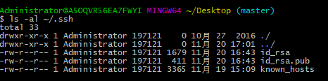
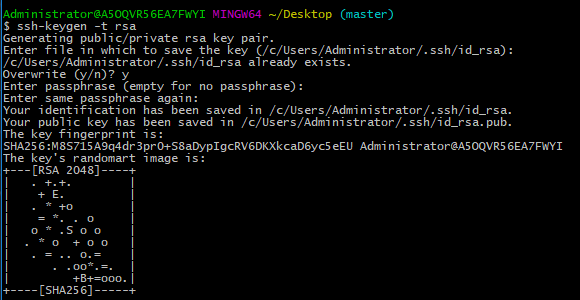
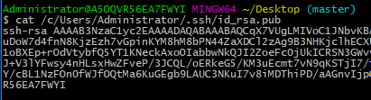

## 解决git提交代码每次都需要输入密码问题
每次我们操作git pull/push到远程的时候，总是提示要输入账号密码才能操作成功，频繁的去输入会比较麻烦。不管是 github/bitbucket 其他代码托管服务都可以通过设置 SSH keys 进行身份验证

### 关于SSH
使用SSH协议，您可以连接和验证远程服务器和服务。使用SSH密钥，您可以在每次访问时无需提供用户名或密码即可连接到GitHub。

### 检查现有的SSH密钥
在生成SSH密钥之前，可以检查是否有任何现有的SSH密钥。

打开 git bash
```
ls -al ~/.ssh
```
 

检查目录列表以查看是否已有公共SSH密钥。
默认情况下，公钥的文件名是以下之一或者其他：

- id_dsa.pub
- id_rsa.pub

如果没有现有的公钥和私钥对，或者不希望使用任何可用的连接到GitHub/bitbucket，则生成新的SSH密钥。
如果你连接到GitHub 的现有公钥和私钥对（例如id_rsa.pub和id_rsa），则可以将SSH密钥添加到ssh-agent。

### 生成新的SSH密钥
```
ssh-keygen -t rsa

```

(当系统提示您“输入要保存密钥的文件”时，按Enter键。这接受默认文件位置。在提示符下，键入安全密码。通常我基本都是一直按 Enter )

### 查看SSH密钥
```
cat /c/Users/Administrator/.ssh/id_rsa.pub

```


### SSH密钥添加到帐户（举个栗子github）

- Settings
- SSH and GPG keys
- New SSH key
- Title（随意描述）
- Key （复制你的密钥）

配置好之后，对代码pull/push到远程的时候提示输入账号密码，之后就不需要再次输入密码了。


#### [使用SSH连接到GitHub](https://help.github.com/articles/generating-a-new-ssh-key-and-adding-it-to-the-ssh-agent/)
