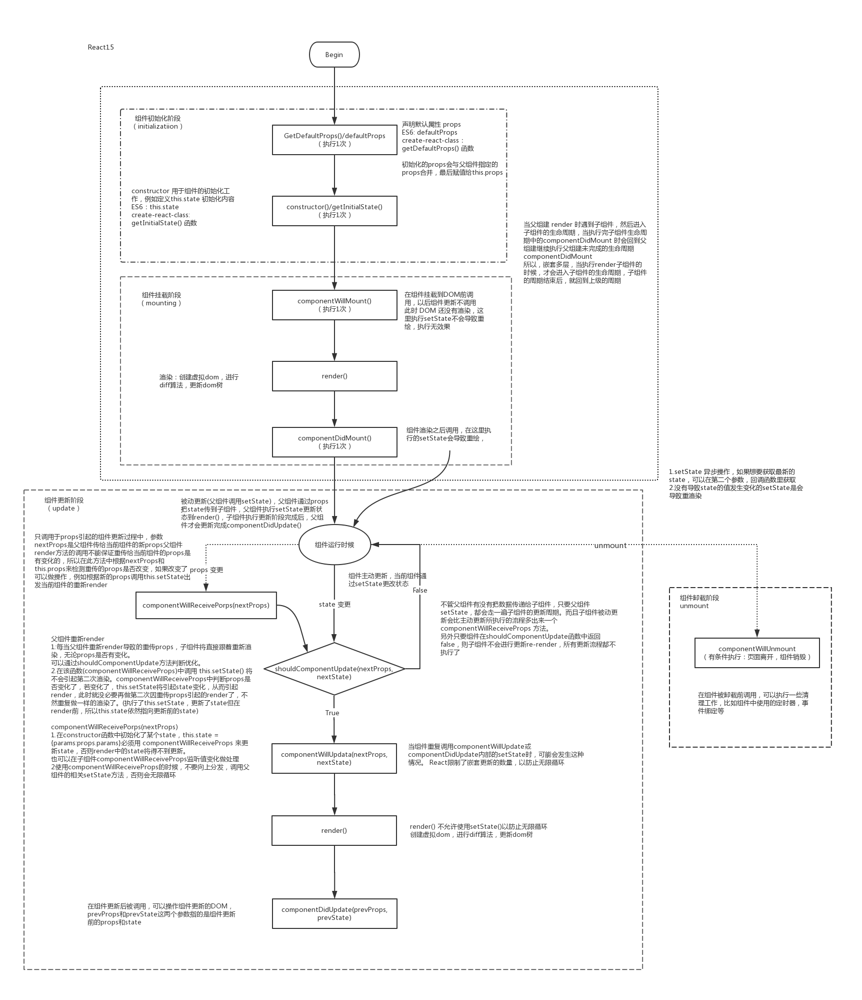

## 学习 React 

### 使用
-  [create-react-app](https://www.npmjs.com/package/create-react-app)

### npm 安装
-  [classnames](https://www.npmjs.com/package/classnames)
-  [styled-components](https://www.npmjs.com/package/styled-components)
-  [prop-types](https://www.npmjs.com/package/prop-types)

### react 
```
rcc rfc

dangerouslySetInnerHTML:dangerouslySetInnerHTML 是 React 为浏览器 DOM 提供 innerHTML 的替换方案。
<div dangerouslySetInnerHTML ={{__html: this.state.divContent} }></div>

React Hook
https://zh-hans.reactjs.org/docs/hooks-intro.html
useState
useEffect

createContext Context (countIndex.js)
https://zh-hans.reactjs.org/docs/context.html#caveats


js 函数式编程指南
https://llh911001.gitbooks.io/mostly-adequate-guide-chinese/content/

HOC Higher-Order component
高阶组件（HOC）是 React 中用于复用组件逻辑的一种高级技巧。HOC 自身不是 React API 的一部分，它是一种基于 React 的组合特性而形成的设计模式。

```
-  [生命周期](https://zh-hans.reactjs.org/docs/react-component.html#componentdidupdate)
-  [ajax请求](https://www.npmjs.com/package/axios)
-  [jsonplaceholder](http://jsonplaceholder.typicode.com/)


-  [react-app-rewired](https://github.com/timarney/react-app-rewired/blob/HEAD/README_zh.md)
-  [customize-cra](https://www.npmjs.com/package/customize-cra)
-  [addDecoratorsLegacy()](https://github.com/arackaf/customize-cra/blob/HEAD/api.md)
```
让cra 支持@装饰器写法
1.不管你是要配置什么，我们最好的方式是使用react-app-rewired这个包来对cra创建的项目进行轻微的配置调整
2.安装好之后，在package.json里吧scripts里的react-scripts 替换成react-app-rewired
3.在根目录下创建一个config-overrides.js
```
```js
module.exports = () =>{
  <!-- 在这里做配置 -->
  return config
}
```
```
4.当然如果想要配置更方便，可以安装 customize-cra，然后把config-overrides.js改成这样
```

```js
const {override,addDecoratorsLegacy} =require('customize-cra')
module.exports = override(
  addDecoratorsLegacy()
)

 "scripts": {
    "start": "react-app-rewired start",
    "build": "react-scripts build",
    "test": "react-scripts test",
    "eject": "react-scripts eject"
  },
```

-  [redux](https://www.redux.org.cn/)
-  [bootcdn](https://www.bootcdn.cn/)
-  [redux](https://www.bootcdn.cn/redux/)


--------------------------项目学习------------------------------------
-  [Lodash](https://www.lodashjs.com/)
_.pick(object, [props])
创建一个从 object 中选中的属性的对象。

参数
object (Object): 来源对象。
[props] (...(string|string[])): 要被忽略的属性。（注：单独指定或指定在数组中。）
返回
(Object): 返回新对象。

例子
var object = { 'a': 1, 'b': '2', 'c': 3 };
 
_.pick(object, ['a', 'c']);
// => { 'a': 1, 'c': 3 }


_.flow([funcs])
创建一个函数。 返回的结果是调用提供函数的结果，this 会绑定到创建函数。 每一个连续调用，传入的参数都是前一个函数返回的结果。

添加版本
3.0.0

参数
[funcs] (...(Function|Function[])): 要调用的函数。
返回
(Function): 返回新的函数。

例子
function square(n) {
  return n * n;
}
 
var addSquare = _.flow([_.add, square]);
addSquare(1, 2);
// => 9


_.get(object, path, [defaultValue])
根据 object对象的path路径获取值。 如果解析 value 是 undefined 会以 defaultValue 取代。
object (Object): 要检索的对象。
path (Array|string): 要获取属性的路径。
[defaultValue] (*): 如果解析值是 undefined ，这值会被返回。
返回

(*): 返回解析的值。

例子

var object = { 'a': [{ 'b': { 'c': 3 } }] };
 
_.get(object, 'a[0].b.c');
// => 3
 
_.get(object, ['a', '0', 'b', 'c']);
// => 3
 
_.get(object, 'a.b.c', 'default');
// => 'default'


promise是什么？
1、主要用于异步计算
2、可以将异步操作队列化，按照期望的顺序执行，返回符合预期的结果
3、可以在对象之间传递和操作promise，帮助我们处理队列

promise是一个对象，对象和函数的区别就是对象可以保存状态，函数不可以（闭包除外）
并未剥夺函数return的能力，因此无需层层传递callback，进行回调获取数据
代码风格，容易理解，便于维护
多个异步等待合并便于解决

new Promise(
  function (resolve, reject) {
    // 一段耗时的异步操作
    resolve('成功') // 数据处理完成
    // reject('失败') // 数据处理出错
  }
).then(
  (res) => {console.log(res)},  // 成功
  (err) => {console.log(err)} // 失败
)

-  [PropTypes进行类型检测](https://segmentfault.com/a/1190000007814801)

// 某种类型的数组
  optionalArrayOf: React.PropTypes.arrayOf(React.PropTypes.number),

  // 具有某种类型的属性值的对象
  optionalObjectOf: React.PropTypes.objectOf(React.PropTypes.number),

   // 采取特定样式的对象
  optionalObjectWithShape: React.PropTypes.shape({
    color: React.PropTypes.string,
    fontSize: React.PropTypes.number
  }),


  immutable

  reselect


  stamp 接口


  时间戳的 位数不一致 转换  在 dao 那层改(进出口)

  react-redux

  connect
  connect的作用是把UI组件（无状态组件）和业务逻辑代码的分开，然后通过connect再链接到一起，让代码更加清晰和易于维护。
  这也是React-Redux最大的优点

  映射关系就是把原来的state映射成组件中的props属性
  const mapStateToProps = state => ({data: state.data})

  const mapDispatchToProps = dispatch => ({
      handleClick: (data) => dispatch(aciton(data))
  })

  export default connect(mapStateToProps,mapDispatchToProps)(View); 

  

  compose
  https://www.jianshu.com/p/47b80356c67a


在 React 项目中，遇到了上面的报错信息。
Super expression must either be null or a function, not undefined
确认一下React.Component是否书写正确，不是React.component或者React.Comonent…（这是我个人的问题，component 拼写错误） 


React解决长列表方案(react-virtualized)


 i18n = getLocaleHelper();
 this.i18n.t('commonText.result.operateOk')

 const t = getLocaleHelper().t;
 t('views.workflow.stepValidate.allMember')