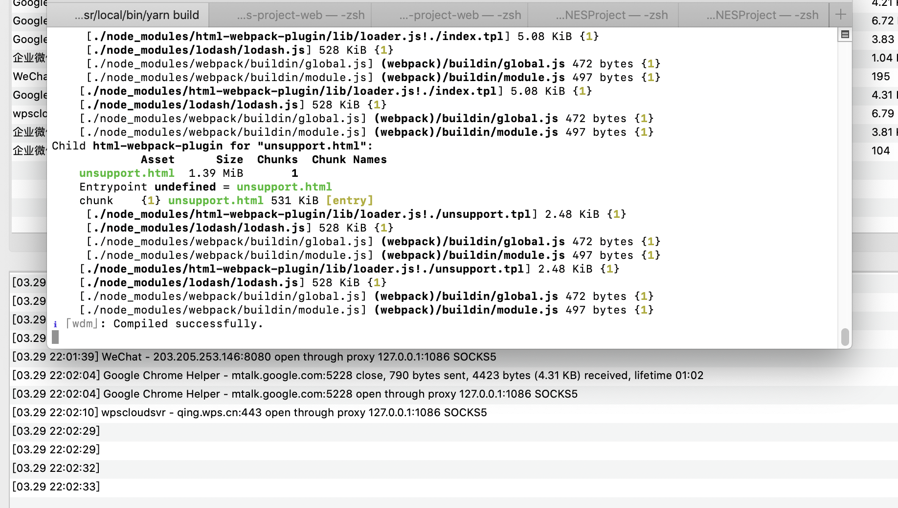
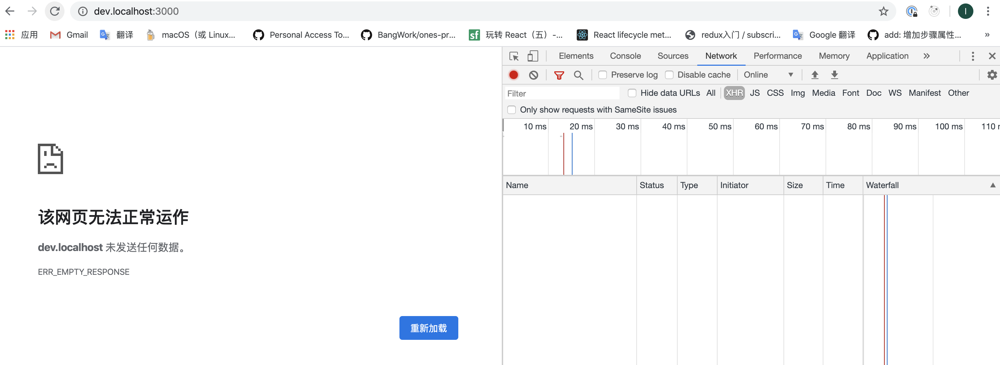
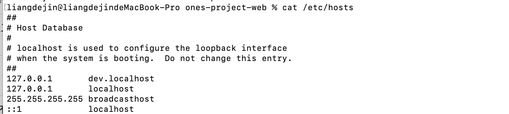
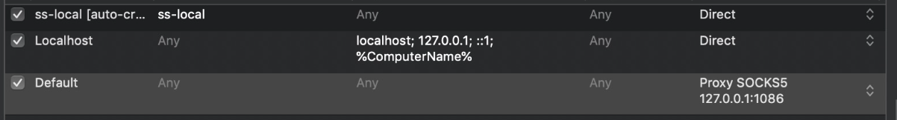

## 项目搭建遇到的环境问题

### listen EADDRINUSE :::3000
```
端口3000被占用

查看端口:
sudo lsof -i tcp:port

kill掉被占用的端口的进程: 
kill PID
```

### [Bug] Node 10.1.0 TLS issue with ldap: Client network socket disconnected before secure TLS connection was established
-  [报错](https://github.com/nodejs/node/issues/21088)
```
ldap的节点10.1.0 TLS问题：建立安全TLS连接之前，客户端网络套接字已断开连接

npm install axios
```

### 3.设置 registry


```
这个错误码的意义是没有返回内容，所以意味着访问的网址，在网络连接层就点开了，否则的话服务器至少会返回一些东西
那么如果这个服务器没启动的话，首先应该检查一下这个网址这个端口是否可以访问的，如果不可以访问,是服务器根本没起起来，还是说因为代理的问题导致连不上

查看防火墙
查看host 配置信息
cat /etc/host
有配置dev.localhost
Ping 看是否能通
代理问题
查看代理及代理第三方 是否修改映射
```

![ping一下是网址还是端口问题]](./PING.png)

