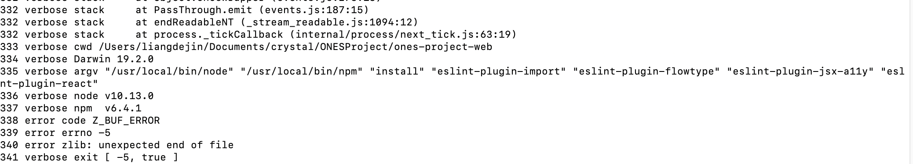
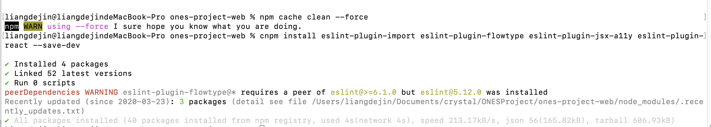

## Error: Failed to load plugin react: Cannot find module 'eslint-plugin-react'。

### 最基本的原则是，缺什么依赖，就安装什么依赖。只是要注意区分，是全局安装还是仅项目安装
```
关于 ESLint 与 eslint-plugin-react 的搭配安装，官方文档是这样描述的：If you installed ESLint globally, you have to install React plugin globally too. Otherwise, install it locally.

* 如果 ESLint 是全局安装的，eslint-plugin-react 也要全局安装，安装命令： cnpm install eslint-plugin-react -g。
* 同理，如果 ESLint 只是在项目下安装，安装命令： cnpm install eslint-plugin-react --save-dev。
```

### 查看 log 报错

```
 "npm ERR! code Z_BUF_ERROR"
需要 清除 npm 缓存
```

### 按要求按照依赖



