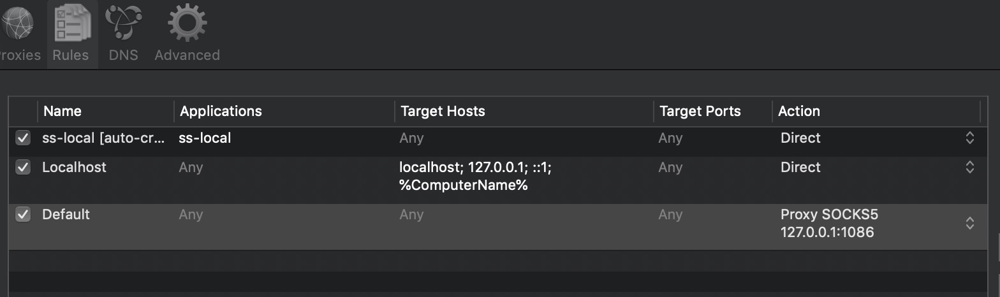

## 终端翻墙 shadowsocks 和 proxifier

-  [proxifier](https://blog.e9china.net/tufan/proxifierzhucemayijipeiheshadowsocksshangwang.html)


### 代理
```
代理, 这个proxifier 就是把你电脑流量转到 ssr上, ssr 转到 vpn 上, vpn 就访问外网了

如果有其他网络情况出问题了, 要想到可能是这里出问题了, 所以不用的时候可以选择关掉

上面两条是自动生成的, 保证你的 shadowsocks 和 本地网络是正常的
开了proxifier , 就要和shadowsocks 的手动模式一起使用, 
关了 proxifier, shadowsocks就可以单独使用其他模式了
```


-  [npm 切换源](https://blog.csdn.net/xiasohuai/article/details/98878716)
